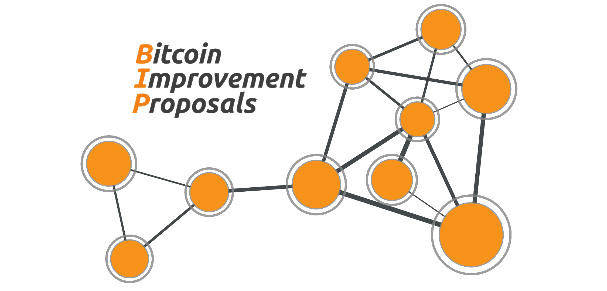

# Proposal Network Graph <!-- omit from toc -->



## Table of Contents
- [Documentation](#documentation)
  - [Requirements](#requirements)
  - [Main.py](#mainpy)
  - [Download.py](#downloadpy)
  - [preamble\_extraction.py](#preamble_extractionpy)
  - [bip\_processor.py](#bip_processorpy)
    - [Metadata](#metadata)
    - [Insights](#insights)
      - [Compliance Section](#compliance-section)
      - [Word List Section](#word-list-section)
  - [visualization/react-vis](#visualizationreact-vis)


## Introduction

This repository started with Bitcoin Improvement Proposals (BIPs) as its first implemented dataset, but the broader goal is an ecosystem-agnostic proposal-analysis pipeline.
Bitcoin is currently the active adapter. Over time, the same repository should support additional ecosystems such as Ethereum EIPs or Tor proposals through the same extraction and visualization flow.

Data is now organized under `ip_data/<ecosystem>/...` and analysis logic under the root `analysis/` module:
- `analysis/authorship`
- `analysis/conformity`
- `analysis/dependencies`

# Documentation

## Requirements
- Git: The script requires Git to clone and update the BIP repository.

## Main.py
Manages all the logic. Once you added the github token and OpenAI API Key, you can run ```main.py```. The active ecosystem is configured in `ecosystem_config.py`. It will
- Clone the active proposal repository if it’s not already present or update it if it is.
- Extract metadata from the Git history.
- Extract the preamble from each proposal document.
- Generate insights from the proposal contents.
- Store all extracted data into JSON files.

## Download.py
Clones the active proposal repository as *.md or *.mediawiki files and also downloads all associated files.
For the current Bitcoin adapter, all files are saved into __ip_data/bitcoin/cloned__.

## preamble_extraction.py
The <code>< pre>...< /pre></code> block gets extracted out of every .md/.mediawiki file inside the active clone folder.
It differentiates between the required fields and the optional fields.
If you have multi-line fields as they often appear in 'author' and 'licences', it adds a list to the corresponding key.
The extracted information inside the preamble gets placed in the __preamble__ section inside the JSON file.
For the current Bitcoin adapter, all JSON files get saved in __ip_data/bitcoin/json__.

## bip_processor.py
Adds metadata and insights about each proposal to the corresponding JSON file. For the metadata, it adds
### Metadata
- **`last_commit`**: The date of the most recent commit for the proposal file (ISO 8601 format).
- **`total_commits`**: The total number of commits made to the proposal file.
- **`metadata_last_updated`**: The timestamp (ISO 8601 format) indicating when the metadata was last updated.
- **`git_history`**: A list of tuples containing the Git commit hash, date, and author for each commit in the proposal's history.
- **`contributors`**: The total number of unique contributors to the proposal file.
- **`google_trend_index`**: Placeholder for storing Google Trends data (not implemented yet).
### Insights
#### Compliance Section
- **`title_length_respected`**: Indicates whether the proposal title length adheres to the active rule set (`true`/`false`).
- **`title_length`**: The actual length of the proposal title in characters.
- **`abstract_length_respected`**: Indicates whether the word count of the "Abstract" section is within the limit of 200 words (`true`/`false`).
- **`abstract_word_count`**: The total word count of the "Abstract" section.
- **`created_date_format_correct`**: Indicates whether the `created` field in the preamble follows the ISO 8601 date format (`true`/`false`).
- **`required_fields_present`**: Indicates whether all required fields in the preamble are present and non-null (`true`/`false`).
- **`missing_fields`**: A list of required fields that are missing or null.
- **`layer_valid`**: Indicates whether the `layer` field in the preamble contains a valid value (`true`/`false`).

#### Word List Section
- **`word_list`**: A dictionary of words extracted from the raw content of the proposal file (excluding stop words). Each word is a key, and its frequency is the value, sorted in descending order of frequency.

## visualization/react-vis
Once you downloaded ```main.py```, you can run ```npm install``` and then ```npm start```. It will start the react server, which you can look at in your browser through the IP ```http://localhost:3000/```.
The landing page now begins with ecosystem selection, with Bitcoin as the currently available dashboard.
Alternatively, a not yet final version of the app is hosted on Github under the the following: ```https://MohammadEglil.github.io/BIPng-Website-```. Just click on Home if the screen only shows the navigation. 

## Deployment
The React app does not need to be built locally for deployment. GitHub Actions can build and deploy it for you.

The repository now includes a GitHub Pages workflow in `.github/workflows/deploy-react-pages.yml`. On every push to `main` or `master`, GitHub will:
- install the frontend dependencies in `visualization/react-vis`
- run `npm run build`
- publish the generated site to GitHub Pages

Recommended workflow:
- test locally with `npm start`
- optionally run `npm run build` locally as a sanity check
- push to GitHub
- let GitHub Actions build and deploy the site

To enable deployment on GitHub:
- open the repository settings
- go to `Settings > Pages`
- set the source to `GitHub Actions`

Because the app uses static hosting, all data that should appear on the website must already be present in the repository, for example the generated `ip_data/<ecosystem>/...` snapshot artifacts.

## Research Question Pipelines (Notebook-Free)
The repository now includes a script-based preprocessing path for network artifacts, so you do not need notebooks to prepare shared RQ data.

Main pipeline output is now ecosystem-scoped under `ip_data/<ecosystem>/artifacts/`:
- `dependencies/network_data_<STICHTAG>.json|.pkl`
- `authorship/authorship_<STICHTAG>.json`
- `conformity/conformity_<STICHTAG>.json`

### Build Snapshot Artifacts
Run this to build both JSON and PKL for a specific STICHTAG snapshot:

`python Research_questions/build_network_data.py --stichtag 2025-12-31`

Outputs:
- `ip_data/bitcoin/artifacts/dependencies/network_data_2025-12-31.json`
- `ip_data/bitcoin/artifacts/dependencies/network_data_2025-12-31.pkl`

Notes:
- JSON artifact is suitable for React/web visualizations.
- PKL artifact is convenient for Python plotting scripts.
- If `--stichtag` is omitted, the script reads from the active ecosystem JSON root and writes `network_data_latest.*`.

### Run RQ3 Plots Against a Snapshot
`python Research_questions/RQ3/RQ3_graphplots.py --stichtag 2025-12-31`

Load order in RQ3 is now:
1. `ip_data/<ecosystem>/artifacts/dependencies/network_data_<STICHTAG>.pkl` (if provided)
2. `ip_data/<ecosystem>/artifacts/dependencies/network_data_latest.pkl`
3. legacy fallbacks (`Research_questions/network_data.pkl`, repo-root `network_data.pkl`)

### Prepare RQ1 Data (Notebook-Free)
`python Research_questions/RQ1/rq1_prepare.py --stichtag 2025-12-31`

Output:
- `Research_questions/artifacts/rq1/rq1_2025-12-31.json`

Contains reusable datasets for:
- top authors
- BIPs per year
- author contribution histogram
- top-10 author share
- collaboration network (nodes + weighted edges)

### Prepare RQ2 Data (Notebook-Free)
`python Research_questions/RQ2/rq2_prepare.py --stichtag 2025-12-31`

Output:
- `Research_questions/artifacts/rq2/rq2_2025-12-31.json`

Contains reusable datasets for:
- full sankey links (Layer → Status → Type)
- grouped-status sankey links
- status distribution by layer
- status-over-time summary

### Suggested Workflow
1. Run `main.py` with your chosen `STICHTAG`.
2. Commit the generated ecosystem outputs under `ip_data/<ecosystem>/json/<STICHTAG>/` and `ip_data/<ecosystem>/artifacts/...`.
3. Run `rq1_prepare.py`, `rq2_prepare.py`, and RQ3 plotting with the same `--stichtag` if you need RQ-specific outputs.
4. Use JSON artifacts for React visualizations and Python/PDF pipelines for publication figures.
