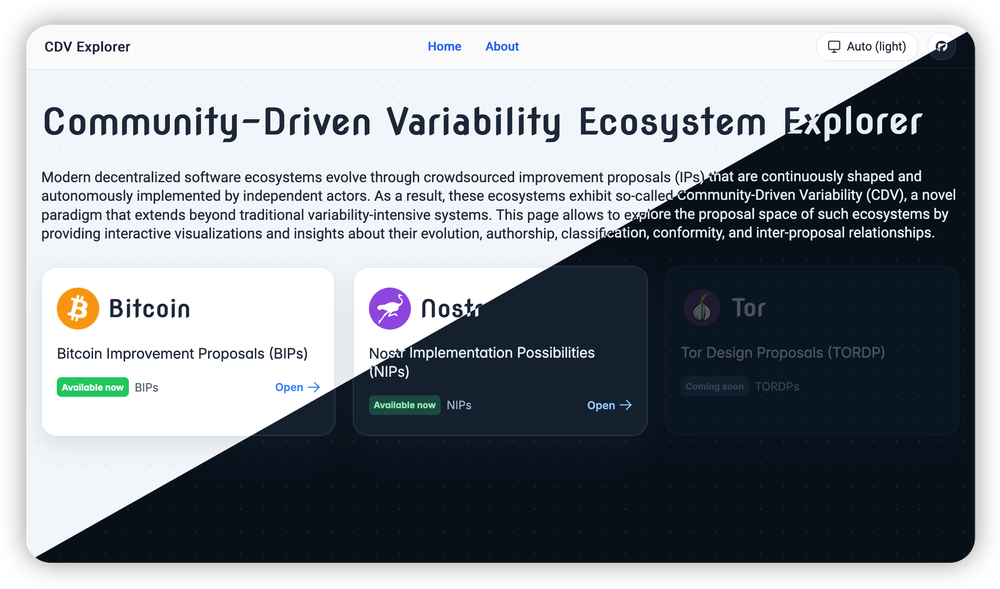
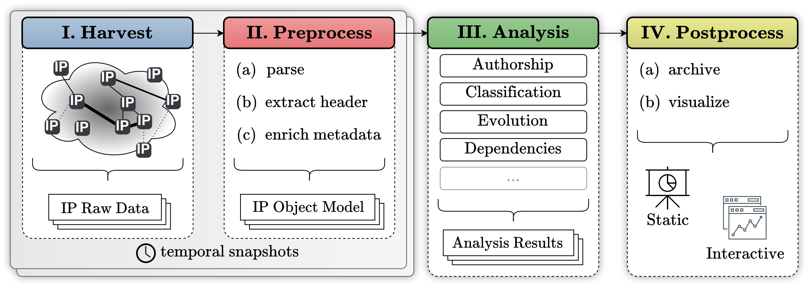

# **CDV Explorer**

_Modern decentralized software ecosystems evolve through crowdsourced improvement proposals (IPs) that are continuously shaped and autonomously implemented by independent actors. As a result, these ecosystems exhibit so-called **Community-Driven Variability (CDV)** [^1], a novel paradigm that extends beyond traditional variability-intensive systems. This tool allows to explore the proposal space of such ecosystems by providing interactive visualizations and insights about their evolution, authorship, classification, conformity, and inter-proposal relationships._


<div align="center">
  <a href="https://seg-unibe.github.io/cdv-explorer/#/">
    
  </a>
</div>

</br>

<div align="center">
  <strong>
    👋 <a href="#introduction">Introduction</a> &nbsp;|&nbsp;
    🚀 <a href="#setup">Setup</a> &nbsp;|&nbsp;
    🛠️ <a href="#developer-notes">Developer Notes</a> &nbsp;|&nbsp;
    🧹 <a href="#cleanup">Cleanup</a>
  </strong>
</div>

</br>

<div align="center">
  <a href="https://github.com/SEG-UNIBE/cdv-explorer/releases">
    
  </a>
  <a href="https://seg-unibe.github.io/cdv-explorer/#/">
    
  </a>
  <a href="https://cdv-explorer.pages.dev/">
    
  </a>
  <a href="https://github.com/SEG-UNIBE/cdv-explorer/actions/workflows/ci.yml">
    
  </a>
  <a href="https://github.com/SEG-UNIBE/cdv-explorer/actions/workflows/deploy-prod.yml">
    
  </a>
</div>

<div align="center">
  
  
  
  
</div>

<div align="center">
  <a href="./LICENSE">
    
  </a>
  <a href="https://youtu.be/56GKRexRuoI"></a>
</div>

</br>
</br>

## Introduction

CDV Explorer is an ecosystem-agnostic pipeline for mining and analysing improvement proposals (IPs).
At the moment, the explorer ships with active source integrations for the following two CDV-exhibiting ecosystems:

| Ecosystem | Proposals | Source repository |
|-----------|-----------|-------------------|
| **Bitcoin** | Bitcoin Improvement Proposals (BIPs) | [bitcoin/bips](https://github.com/bitcoin/bips) |
| **Nostr** | Nostr Implementation Possibilities (NIPs) | [nostr-protocol/nips](https://github.com/nostr-protocol/nips) |

The live site is available at [seg-unibe.github.io/cdv-explorer](https://seg-unibe.github.io/cdv-explorer/#/), with a demo video on [YouTube](https://youtu.be/56GKRexRuoI).

</br>

## Setup

### Requirements

| Tool | Version | macOS using [`brew`](https://brew.sh) | Linux | Windows using [`winget`](https://learn.microsoft.com/windows/package-manager/winget/) |
|------|---------|-------|-------|---------|
| **Python** | 3.12+ | `brew install python` | `sudo apt install python3` | `winget install Python.Python.3` |
| **Node.js** | 22+ (npm bundled) | `brew install node` | `sudo apt install nodejs npm` | `winget install OpenJS.NodeJS` |
| **Git** | any | `brew install git` | `sudo apt install git` | `winget install Git.Git` |

### 1 - Clone the repository

```bash
git clone https://github.com/SEG-UNIBE/cdv-explorer.git
cd cdv-explorer
```

### 2 - Create and activate a virtual environment

```bash
python -m venv .venv
source .venv/bin/activate        # Windows: .venv\Scripts\activate
```

### 3 - Install dependencies

```bash
pip install -r requirements.txt
```

### 4 - Run the pipeline

The `run` command clones/updates the source repository, extracts and enriches proposal data, builds analysis artifacts, and produces React-ready exports -- all in one step.

**Bitcoin (BIPs):**

```bash
python main.py run -e bitcoin -s 2026-03-16 --skipllm
```

**Nostr (NIPs):**

```bash
python main.py run -e nostr -s 2026-03-16 --skipllm
```

> [!NOTE]
> Omit `--skipllm` to also run the OpenAI-based inter-proposal relation extraction. Set the model in the ecosystem YAML under `llm.model`, and provide the API key via the `OPENAI_API_KEY` environment variable or an `apikey.secret` file in the project root. The pipeline picks up the file automatically when the environment variable is not set.

> **Snapshot date:** `-s` is required. The pipeline resolves to the last commit whose committer timestamp falls on or before `YYYY-MM-DD 23:59:59` and checks out the repository at that point.

### 5 - Start the React app

```bash
cd react
npm install
npm start        # Vite dev server, typically at http://localhost:5173
```

The frontend now uses **[Vite](https://vite.dev/)** for local development and production builds.
`npm start` and `npm run dev` both regenerate the snapshot index, proposal link index, and ecosystem metadata before launching the dev server.

For a production build:

```bash
npm run build
```

For the frontend test suite:

```bash
npm test -- --run
```

</br>

## CLI Reference

CDV Explorer is driven by a [Typer](https://typer.tiangolo.com/) CLI.
Run `python main.py --help` for a full overview.

### `run` - execute the full pipeline

```bash
python main.py run [OPTIONS]

Options:
  -e, --ecosystem TEXT   Ecosystem slug (default: first registered)
      --source TEXT      Source slug (default: all sources for that ecosystem)
  -s, --snapshot TEXT    Snapshot date YYYY-MM-DD  [required]
      --skipllm          Skip LLM-based extraction
      --focus TEXT       Process only specific proposals (e.g. '1-9,30-44,85,A0')
```

**Snapshot rebuild workflow:**

When updating LLM extraction, dependency analysis, or other enrichment logic, rebuild only the affected proposals to avoid re-processing large snapshots:

```bash
# Rebuild analysis and postprocess for a specific proposal
python main.py run -e bitcoin -s 2026-03-16 --focus 340 --skipllm

# Rebuild analysis for multiple proposals
python main.py run -e bitcoin -s 2026-03-16 --focus 1-10,320-340 --skipllm

# Rebuild an entire snapshot (regenerate all four pipeline stages)
python main.py run -e bitcoin -s 2026-03-16 --skipllm
```

> [!NOTE]
> The `--focus` flag **skips harvest and preprocess** stages, re-running only analysis and postprocess on the targeted proposals. This preserves existing enrichment (compliance checks, Git history, word clouds) while updating derived metrics.

### `snapshots` - list available snapshots

```bash
python main.py snapshots
python main.py snapshots -e bitcoin
```

### `doctor` - check the local environment

```bash
python main.py doctor
```

Runs read-only checks for required tooling, installed Python packages, configured ecosystem sources, snapshot artifacts, generated frontend indexes, and optional LLM credentials.

### `artifacts rebuild` - regenerate derived artifacts from existing preprocess JSON

```bash
python main.py artifacts rebuild -e bitcoin -s 2026-03-16
python main.py artifacts rebuild -e bitcoin --all
```

Use this when the raw/preprocessed proposal JSON is already available and you only want to rebuild analysis and React-facing exports after changing downstream logic.

### `ground-truth sample-ips` - prefill reviewed IPs for benchmarking

```bash
python main.py ground-truth sample-ips --wizard
```

This interactive helper pre-fills `ground_truth/ips.csv` from a stratified sample of IPs, thereby enlarging the ground truth data set of manually reviewed IPs and their interrelations (maintained in `ground_truth/interrelations.csv`).

### `ecosystems` - manage ecosystem configs

```bash
python main.py ecosystems list                # show all registered ecosystems
python main.py ecosystems show bitcoin        # dump full YAML config as JSON
python main.py ecosystems add                 # scaffold a new ecosystem YAML (interactive)
python main.py ecosystems add-source bitcoin  # add a second IP catalog to an ecosystem
```

</br>

## Developer Notes

### Development dependencies

For local test/development work, install the dev requirements instead of the runtime-only set:

```bash
pip install -r requirements-dev.txt
python -m pytest
```

For the React frontend:

```bash
cd react
npm install
npm test -- --run
npm run build
```

The frontend uses **Vite** for bundling/dev serving and **Vitest** for unit tests.
Build output is written to `react/build` to stay compatible with the existing GitHub Pages and Cloudflare deployment workflows.

### Pipeline architecture

The pipeline transforms raw IP corpora into versioned, frontend-ready datasets in four stages: **Harvest** → **Preprocess** → **Analysis** → **Postprocess**.
Ecosystem-specific logic is confined to the first two stages, keeping the analysis and frontend layers fully reusable across ecosystems.



### Project structure

```bash
.
├── ecosystems/              # ecosystem configs (YAML) — one file per ecosystem
├── pipeline/
│   ├── harvest/             # Stage I  — ecosystem-specific: clone & snapshot checkout
│   └── preprocess/          # Stage II — ecosystem-specific: preamble extraction & enrichment
├── analysis/                # Stage III/IV — ecosystem-agnostic analysis modules & postprocess
│   ├── authorship/
│   ├── classification/
│   ├── conformity/
│   ├── dependencies/
│   ├── evolution/
│   └── wordcloud/
├── react/                   # interactive frontend (D3, PrimeReact)
└── ip_data/
    └── <ecosystem>/         # e.g. bitcoin, nostr, ...
        ├── <source>/        # e.g. bips, slips, ...
        │   ├── 01_harvest/      # raw IP documents             [gitignored]
        │   ├── 02_preprocess/   # IP object model (JSON)       ← Stage II output
        │   ├── 03_analysis/     # analysis artifacts           ← Stage III output
        │   └── 04_postprocess/  # frontend payloads            ← Stage IV output
        ├── _combined/           # precomputed multi-source artifacts
        └── ground_truth/        # curated benchmark CSVs
```

### Preprocess schema

Each proposal is stored as a JSON file under `02_preprocess/<snapshot>/`.
The schema has three top-level blocks: **`raw`** (verbatim preamble), **`meta`** (Git-derived history and timestamps), and **`insights`** (compliance checks, word list, status history, inter-proposal relations).

```json
{
  "raw": {
    "preamble": [dict]
  },
  "meta": {
    "last_commit": [datetime],
    "total_commits": [int],
    "git_history": [/* ... */]
  },
  "insights": {
    "formal_compliance": [/* ... */],
    "word_list": [dict],
    "changes_in_status": [/* ... */],
    "interrelations": {
      "preamble_extracted":   [set of IPs],
      "body_extracted_regex": [set of IPs],
      "body_extracted_llm":   [set of IPs]
    }
  }
}
```

The exact object shapes inside `interrelations` are source-aware and method-specific. 
In particular, targets use `source_slug:id` keys, regex-derived entries carry occurrence counts, and LLM-assisted semantic dependency extraction runs are stored as timestamped run objects with status codes, `run_id` links, and per-dependency metadata. Prompt provenance is stored once per source/snapshot in the shared LLM run manifest.

Concrete examples: [`bip-0340.json`](ip_data/bitcoin/bips/02_preprocess/2026-03-16/bip-0340.json) (Schnorr Signatures) · [`nip-10.json`](ip_data/nostr/nips/02_preprocess/2026-05-30/nip-10.json) (Text Notes and Threads)

### Adding a new ecosystem

1. Run `python main.py ecosystems add` and answer the prompts — a scaffolded `ecosystems/<slug>.yml` is created.
2. Edit the YAML to fill in classification dimensions, conformity standards, preamble field rules, and any other config.
3. Implement the ecosystem-specific **Stage I & II** logic in `pipeline/`:
   - `harvest/` — a harvester that clones or fetches the IP source and checks out a snapshot
   - `preprocess/` — an extractor that parses raw documents into the canonical IP object model, and a compliance checker under `preprocess/checkers/`
4. Add a corresponding adapter under `react/src/ecosystems/<slug>/` (copy `bitcoin/` or `nostr/` as a template).
5. Run `python main.py run -e <slug> -s <date> --skipllm` to verify the pipeline end-to-end.

### Deployment

Production is deployed to GitHub Pages via [`.github/workflows/deploy-prod.yml`](.github/workflows/deploy-prod.yml) after a successful `CI` run on `main` or `master`.
Development builds are deployed to Cloudflare Pages via [`.github/workflows/deploy-dev.yml`](.github/workflows/deploy-dev.yml) after a successful `CI` run on `dev`.
To enable GitHub Pages on a fork, go to `Settings > Pages` and set the source to `GitHub Actions`.
Both workflows build the Vite app and publish the generated `react/build` directory.

</br>

## Cleanup

Deactivate the virtual environment:

```bash
deactivate
```

Optionally remove individual artifacts without deleting the repository:

```bash
rm -rf .venv
rm -rf ip_data/**/01_harvest           # harvested source repos (gitignored, can be large)
rm -rf react/node_modules react/build
```

Or remove everything at once:

```bash
cd .. && rm -rf cdv-explorer
```

</br>
</br>

[^1]: Bögli, R. et al. _Community-driven variability: characterizing a new software variability paradigm._ Autom Softw Eng **33**, 67 (2026). [10.1007/s10515-026-00594-0](https://doi.org/10.1007/s10515-026-00594-0)
